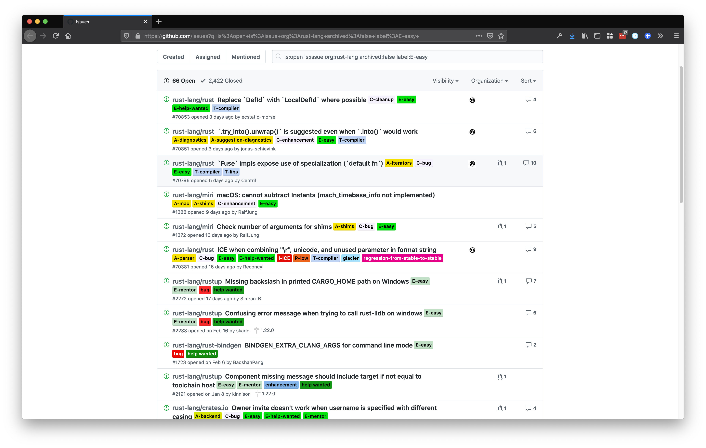

In my [Ultralerning Plan](https://joeprevite.com/rust-learning-plan-chapter-1-notes), I wrote down the following as one of my progress goals:

> Contribute to an open source project

As a new [Rustacean](https://en.wiktionary.org/wiki/Rustacean), I knew it would be best to look for something beginner-friendly such as finding a small bug to fix or contributing to documentation. I am happy to say I found something within my abilities and achieved my goal!

In this article, I share:

- How I found my way within the sea of GitHub issues 🌊
- Solving the issue as a newbie 🤔
- What I learned ✍️
- Where I'm sailing next on my rusty journey ⛵

## Finding an issue with a reasonable scope

> I want to contribute to open-source! Where do I start?

One of the questions that is never easy to answer. There are too many options. You have to narrow it down. Otherwise, you’ll find yourself within a state of [analysis-paralysis](https://en.wikipedia.org/wiki/Analysis_paralysis).

For me, I chose the following parameters to limit my choices:

- beginner-friendly (docs or bugfix)
- something small in scope (ideally, something I could do within a few days)
- only look at repos in [`rust-lang`](https://github.com/rust-lang) GitHub org

This added a fence around the number of possibilities. It made it easier to get started.

I headed over to [GitHub’s issue search](https://github.com/issues) and said, “Show me open issues that are within the `rust-lang` org that have the label ‘E-easy’.” [Here](https://github.com/issues?q=is%3Aopen+is%3Aissue+org%3Arust-lang+archived%3Afalse+label%3AE-easy+) is what it gave me:

Beautiful! Less than 100 issues is something I could actually sit down and sift through.

Somewhere during my search, I stumbled across a label called “E-mentor.”

> Hmm...I wonder what that could be for?

Low and behold, the ocean of the web heard my cries and responded,

> On E-mentor issues an experienced Rust developer has volunteered in the comments to mentor you through solving the issue and[ submitting the fix via GitHub pull request](https://github.com/rust-lang/rust/blob/master/CONTRIBUTING.md#pull-requests) -- [Contributing to Rust](https://prev.rust-lang.org/en-US/contribute-bugs.html)

How amazing is that?! And if the Rust community didn’t already give me enough reasons to love them, they added yet another. It’s a wonderful idea. I hope other communities adopt it.

I modified my [search criteria](https://github.com/issues?q=is%3Aopen+is%3Aissue+org%3Arust-lang+archived%3Afalse+label%3AE-mentor+) to use the “E-mentor” label instead of the “E-easy.” I figured having an experienced Rust developer guiding me would help my learning.

### Sort by least commented

I noticed the number of issues went up to around +90. Instead of looking through all 90 issues, I decided to sort the search by “least commented.” Why?

\
Well, I figured the fewer the number of comments, the greater the likelihood that the issue was yet to be worked. And this proved to be a step in the right direction.

### Choosing an issue

After looking at three to five issues, I finally decided on [this one](https://github.com/rust-lang/rust-by-example/issues/108).

.

(Note: yes, it says closed in the image because I’m writing this blog post after having finished the issue 😄)

Things that stuck out to me about this issue:

- It was created in June 2014 (yes, almost 6 years ago!)
- It was related to documentation ([Rust by Example](https://doc.rust-lang.org/rust-by-example/) is a docs book)
- It had a mentor who said, “I'd be happy to mentor anyone who wants to work on this!”
- The mentor was [@steveklabnik](https://github.com/steveklabnik), co-author of [The Rust Programming Language](https://doc.rust-lang.org/book/) book

I figured if this issue was that old and hadn’t been closed AND had a mentor, then it was worth doing! If I completed it, I’d also be helping clean up old issues in the repo, which we all appreciate.

### Solving the issue

Now that I had an issue to work on, I had to figure out how to solve it. As mentioned before, this was related to documentation. I confirmed that Steve was still willing to mentor me on the issue by pinging them directly on the issue. \

> [@steveklabnik](https://github.com/steveklabnik) it's been a few years 😂 Are you still willing to mentor someone on this?

I'd be up for giving this a shot.

\
Afterward, I commented with my suggested approach and then started the next leg of the journey.

### Familiarizing myself with Rust by Example

I had read about Rust by Example and even used it once or twice, but I didn’t know much beyond that. “How is it built? Where do the pages live that I need to look at?” These are questions I asked myself. Once I research this and find some answers, I’d be able to move on to the next step.

I skimmed through Rust by Example to get a sense of how information was organized in the book. Then, I cloned [the repo](https://github.com/rust-lang/rust-by-example) to understand how things fit together.

Turned out things were pretty straightforward! The book is built with a tool called [mdBook](https://github.com/rust-lang/mdBook). All pages in the book are written in markdown. Woohoo! This meant it was indeed beginner-friendly. Onward!

### Auditing the current situation

In one of Steve’s comments, [they said](https://github.com/rust-lang/rust-by-example/issues/108#issuecomment-602597181),

> I don't know what stuff has landed and what stuff hasn't, if the list above is still relevant, etc.

I knew then my next task was to audit the current situation and see if everything requested was still relevant. I took the list from the issue description and used it to guide my audit.

I posted a summary as a comment on the issue:

My goal with the audit was to make it:

- Easy to skim (emojis helped)
- Short and to the point
- Organized with links
- Summarized with suggested fixes

When you are working with a mentor, document as much of your process as possible. This is beneficial to the mentor to understand how you learn and can easily identify a misstep in understanding. It might even help identify gaps in the current content!

I received a comment shortly afterward clarifying my doubts and confirming my approach. There was no pushback on any suggested changes. I interpreted that as a green light to continue sailing!

### Dividing the work into smaller chunks

I am a big fan of [small wins](https://hbr.org/2011/05/the-power-of-small-wins). When I can achieve things quickly, I build momentum.

Even though all my suggestions could be achieved in one pull request (PR), I intentionally separated them. This allowed me to narrow my focus and open PRs faster.

I started with the easiest tasks to get the ball rolling. I ended up opening three PRs in one sitting.

The last fix took more work because it was adding a completely new page to Rust by Example. I felt less-confident about this one. Instead of making small changes where I was 100% confident, I was adding new content around something I was still learning.

I [opened the PR](https://github.com/rust-lang/rust-by-example/pull/1324) anyway after I felt the knowledge was accurate up to my best abilities. I even left a few comments communicating my doubts.

The beauty of open-source documentation is that anyone can open a PR to get things fixed. If something was inaccurate on my new page, anyone could send a fix for it.

In the end, the reviewer trusted my judgment and merged my PR. Hooray!

I left a comment on the issue indicating that it was ready to be closed. Here’s a list of the four PRs that were merged:

- [fix: make spelling/style of rustdoc consistent](https://github.com/rust-lang/rust-by-example/pull/1321)
- [feat: add sentence about rustdoc & std library](https://github.com/rust-lang/rust-by-example/pull/1322)
- [feat: add doc attributes section to documentation](https://github.com/rust-lang/rust-by-example/pull/1323)
- [feat: add playpen topic](https://github.com/rust-lang/rust-by-example/pull/1324)

## Lessons & Reflections

In the end, I learned a few valuable lessons from this experience. I share them as part of my reflection and desire to continue learning as a new Rustacean. They may help you, but also help me in the future as I tackle more Rust OSS issues.

### You don’t have to be a Rust expert

Anyone can get started contributing to open-source in a language where they’re not a pro. It’s a great way to get your feet wet beyond reading the docs or learning the technology. The more important part is having the motivation to get involved. Once you do that, narrow your focus and get started.

### Rust’s mentorship model should be replicated

I liked the idea of an “E-mentor” while working on my first Rust OSS task. I wish more OSS communities did something similar. In reality, the biggest thing Steve provided me with was support. I received some guidance and feedback, but most of it was self-driven.

Knowing that I had someone who I could reach out to if needed is the key here. It can be intimidating getting involved because you feel like you don’t belong. Or you feel like you don’t know enough yet to help. That is seldom the case.

Steve made me feel welcomed as a new Rustacean and I appreciated that. I hope I can take what I learned here and apply it to other OSS communities I’m involved with.

I had a lot of fun making this a challenge for myself! I feel more motivated to continue contributing to Rust OSS based on this experience.

## What’s next?

Next up in my [Ultralerning Plan](https://joeprevite.com/rust-learning-plan-chapter-1-notes) is to:

> build and ship a small project in Rust

I already built a small [temperature converter](https://github.com/jsjoeio/temperature_converter) suggested by the Rust Lang Book at [the end of Chapter 3](https://doc.rust-lang.org/book/ch03-05-control-flow.html#summary). However, for this particular goal, I assigned myself the task to “Build a small web server app ([bunny1](https://github.com/ccheever/bunny1) clone).”

I already started on [the project](https://github.com/jsjoeio/rusty-bunny) and have made solid progress. I still need to refactor a few pieces and ship it. After, I’ll share a blog post about how I built it and a link so you can check it out.

Thanks for reading! Happy coding my fellow[ Rustaceans](https://doc.rust-lang.org/book/ch01-01-installation.html?highlight=rustacean#troubleshooting)! 🦀

## Thank you!

A special thank you to [Cami Williams](https://twitter.com/cwillycs) and [Joel Marcey](https://twitter.com/JoelMarcey) for reviewing this post.
