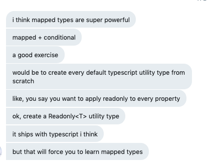

After writing my [review on "Effective TypeScript"](book-review-effective-typescript), I shared it with my friend [@swyx](https://twitter.com/swyx). He read through and shared his thoughts.

One area he talked about was mapped types. Here's what he said:


I decided to give it a go and try to create the utility type from scratch.

## Finding the answer

While prepping for this exercise, I bookmarked the following articles:

- [Mapped Types in TypeScript](https://mariusschulz.com/blog/mapped-types-in-typescript)
- [Mapped Type Modifiers in TypeScript](https://mariusschulz.com/blog/mapped-type-modifiers-in-typescript)
- [TypeScript Handbook: Mapped Types](https://www.typescriptlang.org/docs/handbook/advanced-types.html#mapped-types)

I started with the TypeScript Handbook, only to realize the answer was right in front of me. Oops.

I decided instead of ignoring that, I'd take this blog post to walkthrough my understanding of how it works.

## Creating the Readonly Utility Type

Before we look at how the `Readonly` utility type is created, let's imagine what it might look like:

```javascript
// Here's what it is Readonly<T>
// Essentially it's like a function that types in a type and returns a modified type
// (Type) => readonly Type
```

Now let's use the actual utility type and see what it yields:

```typescript
// yields type TSNames = readonly string[]
type Names = Readonly<string[]>
```

Great! Now, let's take a look at the implementation:

```typescript
type Readonly<T> = {
  readonly [P in keyof T]: T[P]
}
```

Okay. I see this but it feels difficult to read. Let's rename the generics:

```typescript
type Readonly<YourType> = {
  readonly [Key in keyof YourType]: YourType[Key]
}
```

We're taking `YourType`, mapping the left side of the ":" to the right side. We mark each `Key` as `readonly` and then give you back your same type, with the new updates.

Here, I thought, "but wait, what if you give it a `string`?"

That's when I remembered **everything in JavaScript is really an object.** (by this, I mean everything _looks like an object_)

## Creating the Partial Utility Type

Let's look at one more utility type: the `Partial` type.

This is used for when you want to make everything optional. An example might look like this:

```typescript
type User = {
  name: string
  email: string
  password: string
}

type PartialUser = Partial<User>
// yields
// type PartialUser = {
//     name?: string | undefined;
//     email?: string | undefined;
//     password?: string | undefined;
// }
```

Instead of looking at the answer, let's learn by refactoring our `Readonly` type:

```typescript
type Partial<YourType> = {
  [Key in keyof YourType]?: YourType[Key]
}
```

How did we know to put the question mark (the optional modifier) right there? Well, think about how you use it normally. You add it after the key in the type, like this:

```typescript
type User = {
  name?: string
  //...
}
```

The same thing happens: we map the left to the right and boom, we have our utility type.

Hopefully that helped you better understand mapped types in TypeScript.
